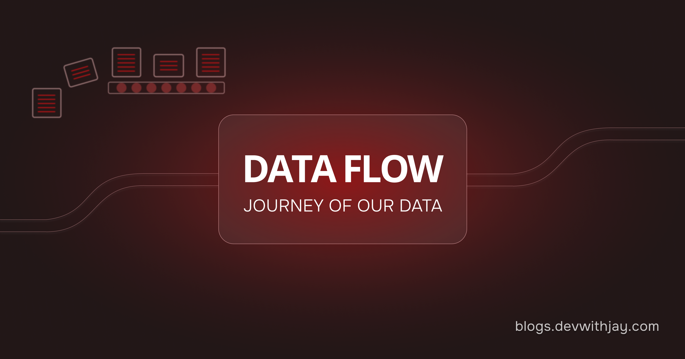
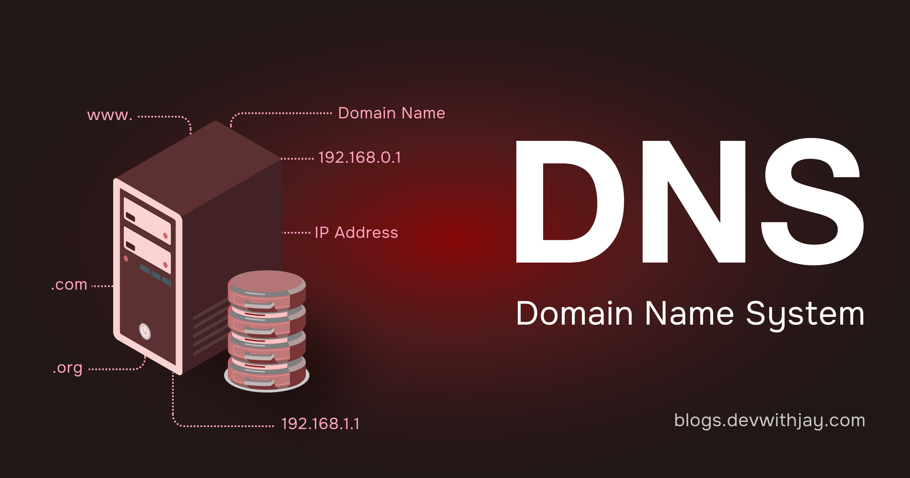
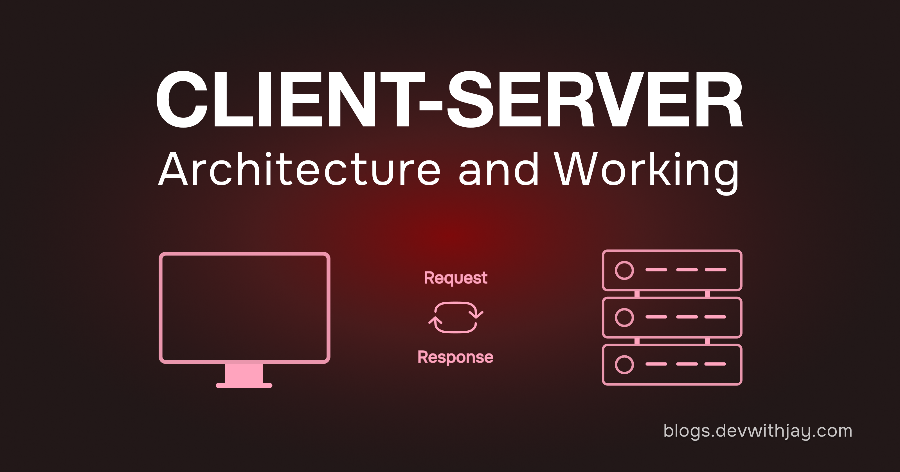
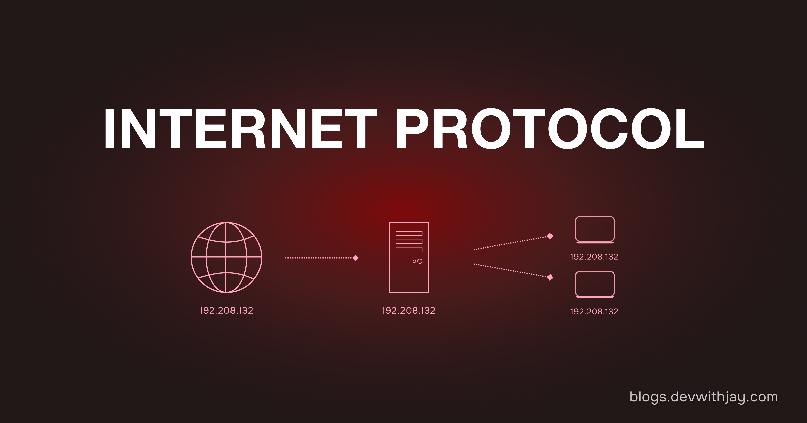
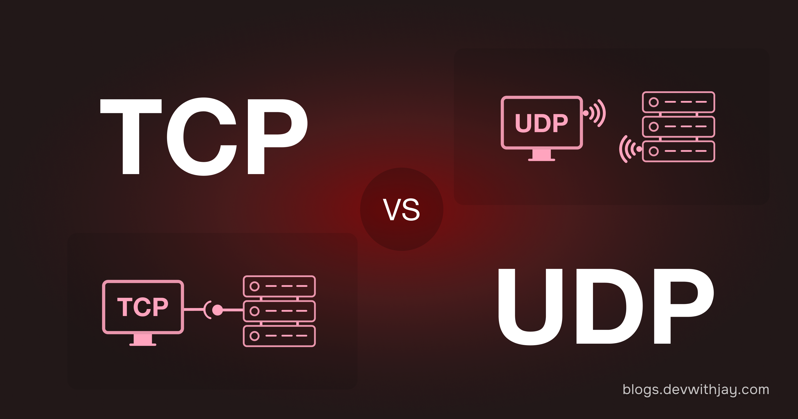
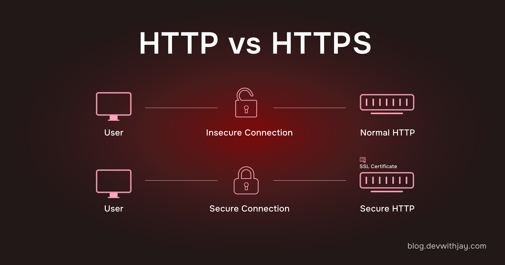
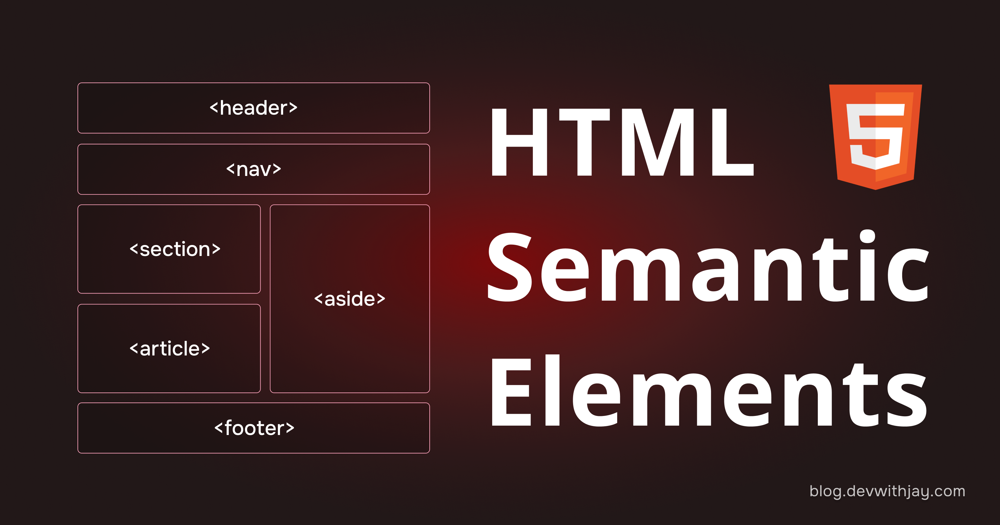
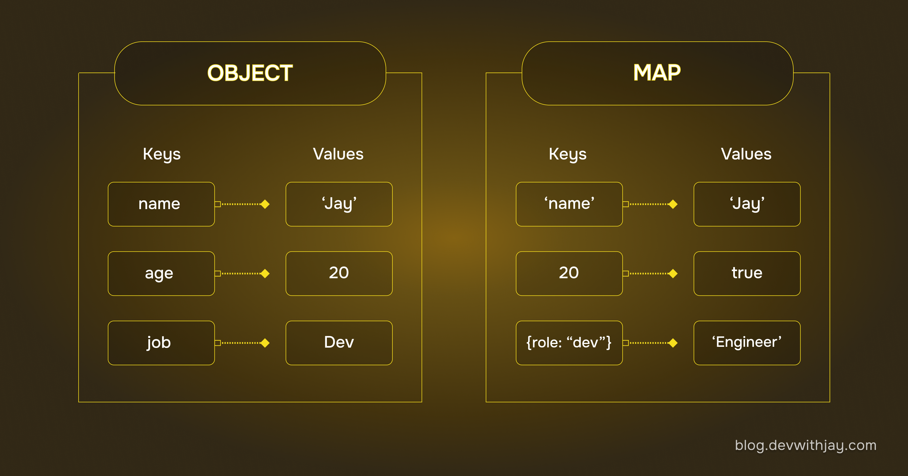
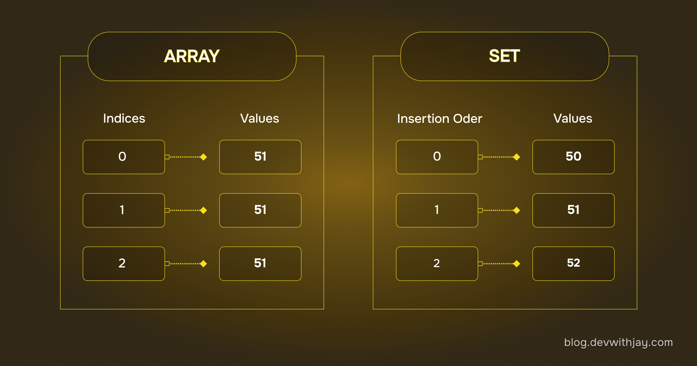

<a href="https://blog.devwithjay.com/">
  <h1 align="center">Blogs Archive</h1>
</a>

  Showcase of my journey to building a solid Foundation.

&nbsp;&nbsp;

 

### [Hidden Journey Of Our Data](https://blog.devwithjay.com/journey-of-data)

  <a href="https://blog.devwithjay.com/journey-of-data">
      

      
    

  </a>

 

### [DNS Simplified](https://blog.devwithjay.com/dns-demystified)

  <a href="https://blog.devwithjay.com/dns-demystified">
      

      
    

  </a>

 

### [Client-Server Architecture](https://blog.devwithjay.com/client-server)

  <a href="https://blog.devwithjay.com/client-server">
      

      
    

  </a>

 

### [The Internet Protocol](https://blog.devwithjay.com/internet-protocol)

  <a href="https://blog.devwithjay.com/internet-protocol">
      

      
    

  </a>

 

### [TCP & UDP Protocls](https://blog.devwithjay.com/tcp-udp)

  <a href="https://blog.devwithjay.com/tcp-udp">
      

      
    

  </a>

 

### [HTTP vs HTTPS](https://blog.devwithjay.com/http-vs-https)

  <a href="https://blog.devwithjay.com/http-vs-https">
      

      
    

  </a>

 

### [HTML Semantics](https://blog.devwithjay.com/html-semantics)

  <a href="https://blog.devwithjay.com/html-semantics">
      

      
    

  </a>

 

### [Objects v/s Maps](https://blog.devwithjay.com/objects-vs-maps)

  <a href="https://blog.devwithjay.com/objects-vs-maps">
      

      
    

  </a>

 

### [Arrays v/s Sets](https://blog.devwithjay.com/arrays-vs-sets)

  <a href="https://blog.devwithjay.com/arrays-vs-sets">
      

      
    

  </a>

 

## Contributing

Contributions are always welcome!

See [CONTRIBUTING.md](../CONTRIBUTING.md) for ways to get started.
  
