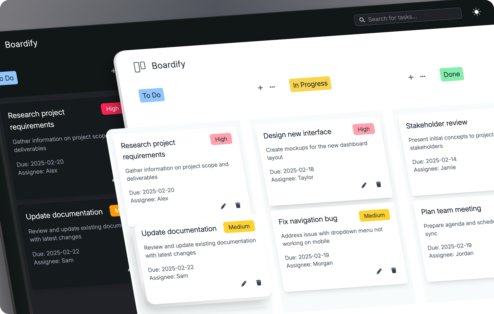

<a href="https://the-boardify.vercel.app">
  <h1 align="center">Boardify</h1>
</a>

<p align="center">
  A simple and intuitive Kanban board to manage your tasks efficiently.
</p>

<p align=center>
  
<p>

<div align="center">

[](https://twitter.com/devwithjay)&nbsp;&nbsp;[](https://www.linkedin.com/in/devwithjay/)&nbsp;&nbsp;[](mailto:hello@devwithjay.com)&nbsp;&nbsp;[](https://conventionalcommits.org)&nbsp;&nbsp;[](https://choosealicense.com/licenses/mit/)

</div>

<h2 align="center">

 &nbsp;[See it in Action](https://the-boardify.vercel.app/) &nbsp;»

</h2>

<br>

<p align="center">
  <a href="#introduction"><strong>Introduction</strong></a> 
	·&nbsp;<a href="#features"><strong>Features</strong></a> 
	·&nbsp;<a href="#tech-stack"><strong>Tech Stack</strong></a>
  ·&nbsp;<a href="#️local-development"><strong>Development Setup</strong></a>
  ·&nbsp;<a href="#contributing"><strong>Contributing</strong></a>
</p>
<br>

## <a name="introduction">❄️ &nbsp; Introduction</a>

Boardify is a lightweight and efficient Kanban board designed to help you organize tasks effortlessly. Explore the codebase to discover more.

<a href="https://the-boardify.vercel.app/">
  <p align=center>
    
  <p>
</a>

<br>

## <a name="features">🔋 &nbsp; Features</a>

- Create Tasks
- Edit & Delete Tasks
- Drag & Drop
- Task Reordering

- Task Prioritization
- Search & Filter
- Multiple Board Support

- Dark/Light Theme

- Local Storage Persistence

- Fully Responsive Design

<br>

## <a name="tech-stack">⚙️ &nbsp; Tech Stack</a>

- [HTML5](https://developer.mozilla.org/en-US/docs/Web/HTML) – structuring
- [Tailwind CSS](https://tailwindcss.com/) – utility-first styling
- [JavaScript](https://developer.mozilla.org/en-US/docs/Web/JavaScript) – functionality
- [Git](https://git-scm.com/) – version control
- [Vercel](https://vercel.com/) – deployment

<br>

## <a name="local-development"> 🖥️&nbsp;&nbsp; Local Development</a>

0.  **Prerequisites** <br>
    Make sure you have the following installed on your machine:

    - [Git](https://git-scm.com/)
    - [Node.js](https://nodejs.org/en) (v20+)
    - [pnpm](https://pnpm.io/) (Package Manager)

1.  **Clone the repository:**

    ```bash
    git clone https://github.com/devwithjay/boardify.git
    ```

2.  **Navigate to the project directory:**

    ```bash
    cd boardify
    ```

3.  **Install dependencies:**

    ```bash
    pnpm install
    ```

4.  **Start the App:**

    ```bash
    pnpm dev
    ```

    Visit &nbsp;[http://localhost:3000](http://localhost:3000)&nbsp; to access your app.

<br>

## Contributing

Contributions are always welcome!

See [CONTRIBUTING.md](./CONTRIBUTING.md) for ways to get started.

<br>

## 🪪&nbsp;&nbsp; Licensing Information

This project is licensed under the [MIT License](./LICENSE). Feel free to learn, add upon, and share!
